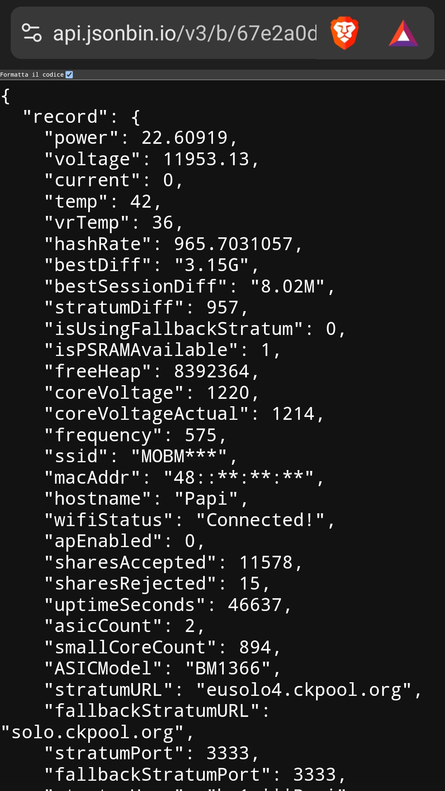

# ESPMinerJSON

## Overview
This project is an Arduino-based solution that fetches miner data from a AxeOS miner API  [ESP-Miner](https://github.com/bitaxeorg/ESP-Miner), obfuscates sensitive fields, and then sends the data to a JSONBin cloud storage. It utilizes Wi-Fi to communicate with the miner device and the JSONBin API to store the data remotely. 
The primary use case is for securely storing miner information in a centralized JSONBin without exposing sensitive data such as BTC addresses, SSID, and MAC addresses, while also ensuring that the miner itself is not exposed to the internet.

You can view your miner data via this url: https://api.jsonbin.io/v3/b/REPLACE-WITH-YOUR-BINID

Example:

## Features
- **Fetch Miner Data**: Retrieves system information from a local miner (e.g., via API at `http://YOURMINERIP/api/system/info`).
- **Obfuscation**: Obfuscates sensitive fields (e.g., BTC addresses, SSID, MAC addresses) before storing them in JSONBin.
- **Data Storage**: Sends the modified data to JSONBin via the API to a specified bin ID.
- **Wi-Fi Connectivity**: Connects to a Wi-Fi network and ensures the device can communicate with both the miner and JSONBin API.
- **Automated Task**: Runs the process automatically every 10 minutes.

## Requirements

### Hardware
- ESP32 or compatible board.
- Wi-Fi network for connectivity.

### Software
- Arduino IDE with ESP32 support.

### Required Libraries
- `WiFi.h`
- `HTTPClient.h`
- `ArduinoJson.h`

## Installation

### Arduino IDE:
1. Install the Arduino IDE from [here](https://www.arduino.cc/en/software).
2. Install ESP32 board support via the Arduino Board Manager.

### Libraries:
Install the following libraries via the Arduino Library Manager:
- `WiFi`
- `HTTPClient`
- `ArduinoJson`

## Code Walkthrough

### Global Variables
- `ssid` and `wifiPassword`: These store the credentials for your Wi-Fi network.
- `minerIP`: The IP address for the local miner API that provides system information.
- `binID`: The ID of the bin where the data will be sent.
- `jsonBinURL`: The base URL for the JSONBin API.
- `apiKey`: The API key for authenticating with the JSONBin service.

### Functions
- **`obscureBTCAddress`**: Takes a Bitcoin address as input and obfuscates it by hiding most of the characters, showing only the first 4 and last 4 characters.
- **`obscureSSID`**: Takes an SSID (Wi-Fi network name) and obfuscates it by showing the first 4 characters and masking the rest.
- **`obscureMACaddr`**: Takes a MAC address and obfuscates the middle section (leaving the first three characters visible).
- **`sendToJsonBin`**: Sends the JSON data (payload) to the JSONBin API using a PUT request. The data is uploaded to a specific bin identified by `binID`.
- **`fetchMinerData`**: Fetches the miner data from the local miner using an HTTP GET request. The received JSON data is parsed, and sensitive fields are obfuscated using the functions defined above. The modified data is serialized and sent to the JSONBin API.

### `setup` Function
- Initializes serial communication and Wi-Fi connection.
- Waits until the ESP32 connects to the specified Wi-Fi network.
- Calls the `fetchMinerData` function to fetch and upload miner data once.

### `loop` Function
- The loop function executes every 10 minutes (600,000 milliseconds) and repeatedly calls the `fetchMinerData` function to ensure that the miner data is updated in the JSONBin cloud storage.

## Security Considerations
- **Obfuscation**: Sensitive information like BTC addresses, SSIDs, and MAC addresses are obfuscated before being sent to JSONBin. This ensures that only partial, non-sensitive data is stored remotely.
- **API Key**: Ensure that your API key is kept private and is not exposed publicly (e.g., in repositories or on the web). Consider using environment variables or a secure method to handle sensitive data.

  ## Create a JSONBin Account

To use this project, you'll need to create an account on [JSONBin.io](https://jsonbin.io) and obtain your API key and bin ID.

1. **Create a JSONBin Account**:
   - Go to [JSONBin.io](https://jsonbin.io) and create an account.
   - After registration, log in to your account.

2. **Create a New public Bin**:
   - Once logged in, click on the **"Create New Bin"** button.
   - This will create a new bin where your miner data will be stored.
   - After creating the bin, you'll be redirected to the bin’s page.

3. **Get the Bin ID and API Key**:
   - In the bin’s page, you'll find a **bin ID** in the URL (e.g., `https://jsonbin.io/v3/b/your-bin-id`). Copy this **bin ID**.
   - To find your **API Key**, click on your profile icon in the top right corner and navigate to **Account Settings**. You can find your API key there.
   - Copy your **API Key** as well.

## Configuration
Before running the code, make sure to:

- **Wi-Fi Settings**: Update `ssid` and `wifiPassword` with your own network credentials.
- **Miner API**: Ensure that the miner's IP address (`minerIP`) and API endpoint are correct and accessible.
- **JSONBin**: Replace `binID` and `apiKey` in the code with your actual JSONBin bin ID and API key to ensure successful data upload.

## Troubleshooting
- **Wi-Fi Issues**: If the ESP32 cannot connect to your Wi-Fi network, ensure that the credentials are correct and that the ESP32 is within range of the Wi-Fi network.
- **API Issues**: If the miner API is not responding, verify that the miner's IP is correct and that it is accessible from the ESP32.
- **JSON Parsing Errors**: If the data received from the miner is invalid or malformed, ensure that the miner API is returning a valid JSON response.

## License
This project is open-source. Feel free to fork, modify, and contribute. Ensure that you comply with all relevant licenses when using external services like JSONBin.

This project automates the process of fetching, obfuscating, and storing miner data securely in the cloud. By using JSONBin and obfuscation techniques, sensitive information is kept safe while still allowing you to store and analyze data remotely.
